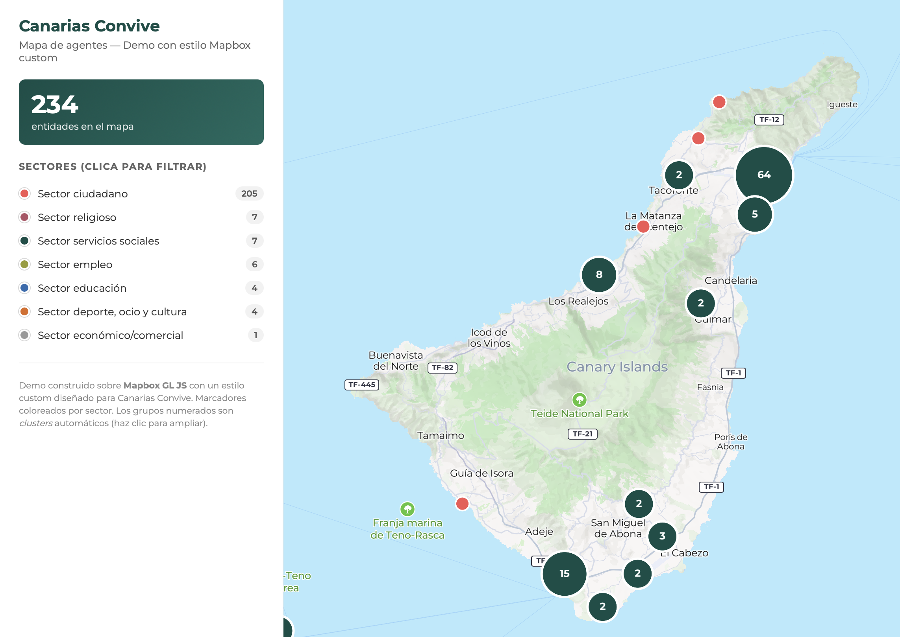

# Canarias Convive — Mapa de agentes

Rediseño del mapa público del programa **Canarias Convive** (Gobierno de Canarias + Universidad de La Laguna). Sustituye el mapa por defecto de Mapbox por un estilo cartográfico custom alineado con la identidad visual del programa, añade clustering, filtros, búsqueda, vista 3D con terreno y panel de detalle.

🔗 **Demo en vivo:** [diegoalegil.github.io/canariasconvive-mapa](https://diegoalegil.github.io/canariasconvive-mapa/)



## El problema

El mapa público en `canariasconvive.com/mapa-de-agentes/` carga vía iframe una aplicación SvelteKit que muestra 234 entidades del archipiélago canario. La implementación actual tiene varios problemas de UX:

- Estilo base de Mapbox sin personalizar — colores saturados que compiten con los marcadores.
- 234 marcadores apilados en zonas urbanas (Las Palmas, Santa Cruz) sin clustering — resulta ilegible.
- Filtros enterrados en un modal con dropdowns confusos.
- Sin coherencia visual con el resto de la web (paleta, tipografía).

## La solución

Este repo es una demo standalone que rediseña esa experiencia:

- **Estilo Mapbox custom** diseñado en Mapbox Studio con la paleta corporativa: verde `#0D4E47`, coral `#F55654`, oliva `#979C30`, burdeos `#B15265`. Tipografía Montserrat (coherente con la web).
- **Clustering automático** — los marcadores se agrupan cuando se solapan; un clic en el cluster hace zoom y se desagrupan.
- **Marcadores coloreados por sector** — el sector de cada entidad se reconoce de un vistazo por el color del punto.
- **Vista 3D con terreno real** — Mapbox DEM con exageración 2.5× muestra el Teide, la Caldera de Taburiente y el resto de volcanes en perspectiva. Edificios sector-coloreados se alzan desde cada marcador.
- **Filtros combinables** por sector y por isla. Al filtrar por isla, la cámara vuela hasta ella.
- **Búsqueda por substring** insensible a acentos y mayúsculas, contra nombre, municipio, provincia, dirección, sector y protagonista.
- **Panel de detalle** lateral con dirección, teléfono, email, redes sociales, logo y botón "Cómo llegar" que abre Google Maps con direcciones.
- **Responsive mobile** — en móviles el sidebar se convierte en una bottom sheet expandible (tap en el handle para alternar).
- **Accesibilidad** — pills y cards son `<button>` con `aria-pressed`, foco visible con `:focus-visible`, viewport sin bloquear zoom del usuario.

## Tecnología

- HTML / CSS / JavaScript vanilla. Sin frameworks ni build tools.
- [Mapbox GL JS](https://docs.mapbox.com/mapbox-gl-js/) v3.21 para el render del mapa.
- [Turf.js](https://turfjs.org/) v7.3 para generar las geometrías de los edificios 3D extruidos.
- Estilo custom publicado: `mapbox://styles/canarias-convive/cmpeoky6e001s01sc9al820l5`.
- Terreno: `mapbox://mapbox.mapbox-terrain-dem-v1` (Mapbox DEM global).
- Datos obtenidos de la API REST que utiliza la aplicación oficial (`api.canariasconvive.com/rest/queryEntities`, descubierta inspeccionando el bundle de la web pública). Logos en `api.canariasconvive.com/rest/uploaded/entities/<uuid>.png`.
- Tipografía: [Montserrat](https://fonts.google.com/specimen/Montserrat) vía Google Fonts.

## Cómo correrlo en local

Para clonar y servir la demo con tu propio token de Mapbox:

1. Crea una cuenta en [mapbox.com](https://account.mapbox.com/auth/signup/) y copia el **Default public token** desde [Access Tokens](https://account.mapbox.com/access-tokens/).
2. Edita `index.html` y reemplaza el token hardcodeado (línea con `mapboxgl.accessToken = '...';`) por el tuyo. Para producción, restríngelo en Mapbox a la URL desde la que sirvas.
3. Sirve la carpeta con cualquier servidor estático:
   ```bash
   python3 -m http.server 8000
   ```
   Y abre `http://localhost:8000`.

## Estructura

```
.
├── index.html           # App completa (HTML + CSS + JS en un único archivo)
├── entities.geojson     # 234 entidades como FeatureCollection enriquecida
├── entities-raw.json    # Respuesta original del endpoint REST (para referencia)
├── screenshot.png       # Captura usada en el README
└── README.md
```

## Roadmap

- [x] Compartir un agente concreto vía URL (`?entity={uuid}`).
- [x] CI semanal que audita los 386 enlaces externos del geojson.
- [ ] Persistir filtros (isla/sector/búsqueda) en la URL.
- [ ] Leyenda persistente con conteos por sector vinculados al filtro activo.
- [ ] Estado seleccionado sincronizado entre marcador y card.
- [ ] Cache local de datos (Service Worker) para que cargue offline.
- [ ] GitHub Actions que refresca `entities.geojson` cada noche.
- [ ] Búsqueda con puntuación ponderada (nombre prioritario sobre tipología).

## Licencia

MIT. Ver [LICENSE](LICENSE).

Datos del programa Canarias Convive — Fundación General de la Universidad de La Laguna.
